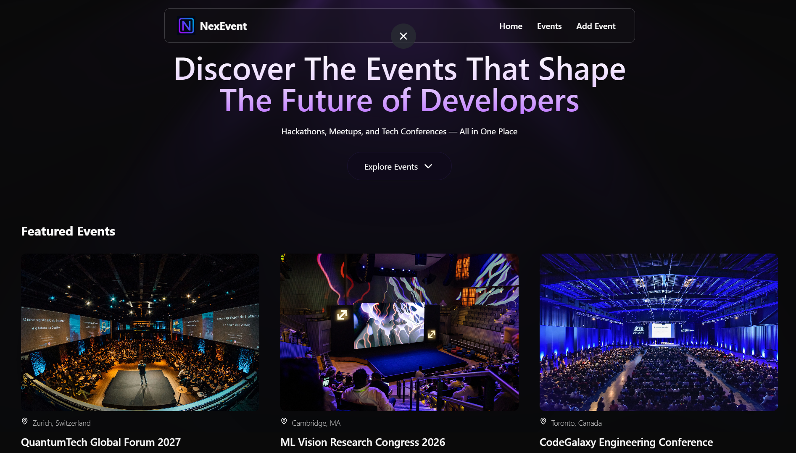
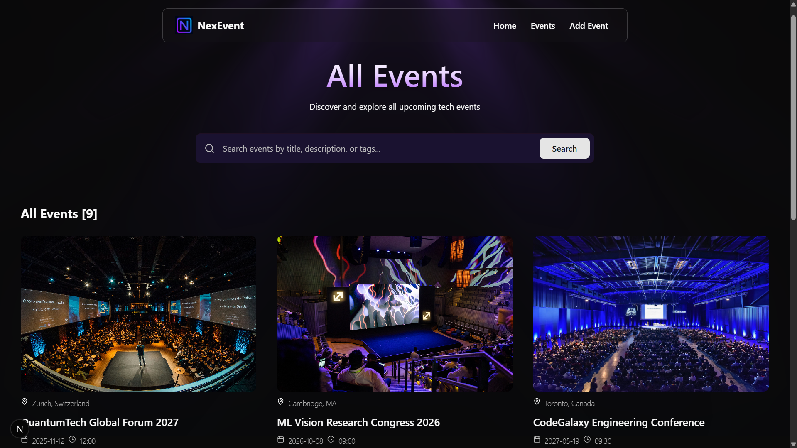
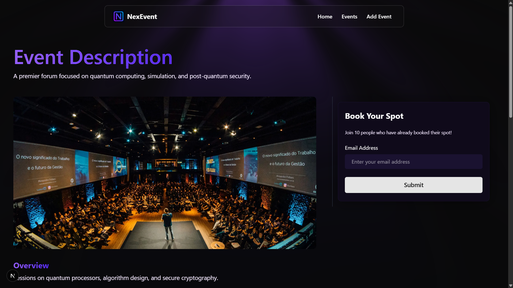
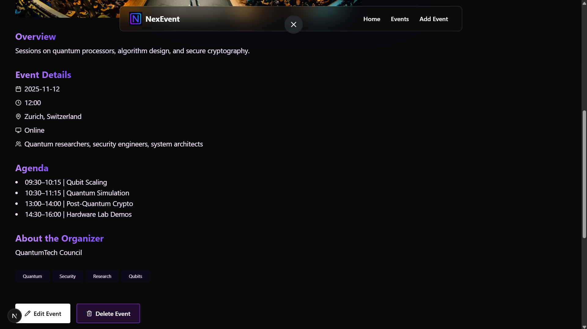
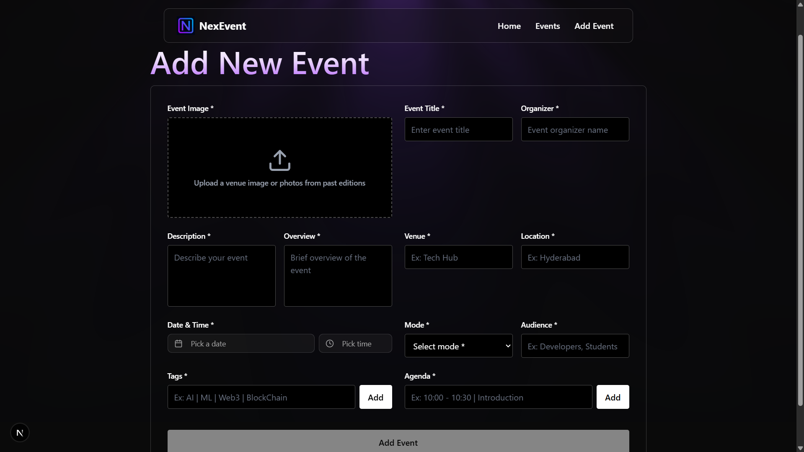

# NexEvent

A full-stack platform for discovering developer events. Browse hackathons, meetups & conferences, book your spot, or create your own event.

## 📸 Screenshots

### Home Page



### Events Page



### Event Details



### Event Details (Scrolled)



### Create Event



## ✨ Features

- 🎯 Browse and discover tech events
- 📅 Create and manage events
- 🎫 Book event with email
- 📱 Responsive design
- 🔍 Search and filter events
- 🏷️ Tag-based categorization
- 📝 Detailed event pages with agenda

## 🚀 Tech Stack

- **Framework:** Next.js 16 (App Router)
- **Language:** TypeScript
- **Styling:** Tailwind CSS
- **Database:** MongoDB with Mongoose
- **Validation:** Zod
- **Image Upload:** Cloudinary
- **UI Components:** Radix UI + shadcn/ui + React Bits
- **State Management:** React Hooks
- **Notifications:** Sonner

## 📁 Project Structure

```
my-app/
├── app/                    # Next.js App Router pages
├── components/             # React components
│   ├── form/              # Reusable form components
│   └── ui/                # shadcn/ui components
├── hooks/                 # Custom React hooks
├── lib/                   # Utilities and helpers
│   ├── actions/          # Server Actions
│   ├── validations/      # Zod schemas
│   └── utils.ts          # Helper functions
├── database/              # Mongoose models
└── public/                # Static assets
```

## 🛠️ Installation

1. **Clone the repository**

   ```bash
   git clone https://github.com/YOUR_USERNAME/NexEvent.git
   cd NexEvent/my-app
   ```

2. **Install dependencies**

   ```bash
   pnpm install
   # or
   npm install
   ```

3. **Set up environment variables**

   Create a `.env` file in the root directory:

   ```env
   # MongoDB (Required)
   MONGODB_URI=your_mongodb_connection_string

   # Cloudinary (Required)
   CLOUDINARY_CLOUD_NAME=your_cloud_name
   CLOUDINARY_API_KEY=your_api_key
   CLOUDINARY_API_SECRET=your_api_secret

   # App URL (Required)
   NEXT_PUBLIC_BASE_URL=http://localhost:3000

   # PostHog Analytics (Optional)
   NEXT_PUBLIC_POSTHOG_KEY=your_posthog_key
   NEXT_PUBLIC_POSTHOG_HOST=https://us.i.posthog.com
   ```

   **Get credentials:**

   - MongoDB: [mongodb.com/cloud/atlas](https://www.mongodb.com/cloud/atlas)
   - Cloudinary: [cloudinary.com](https://cloudinary.com/)
   - PostHog: [posthog.com](https://posthog.com/) (optional)

4. **Run the development server**

   ```bash
   pnpm dev
   ```

5. **Open [http://localhost:3000](http://localhost:3000)**

## 🤝 Contributing

Contributions are welcome! Please feel free to submit a Pull Request.

1. Fork the project
2. Create your feature branch (`git checkout -b feature/AmazingFeature`)
3. Commit your changes (`git commit -m 'Add some AmazingFeature'`)
4. Push to the branch (`git push origin feature/AmazingFeature`)
5. Open a Pull Request

## 📝 License

```
This project is open source and available under the [MIT License](LICENSE).
```

---

⭐ If you like this project, please give it a star!
