# NexEvent

Event management platform for the developer community. Browse hackathons, meetups, & conferences, or create and manage your own events.

🔗 **Live Demo:** [https://nex-event-flax.vercel.app](https://nex-event-flax.vercel.app)

## Tech Stack

| Category           | Technologies                                           |
| ------------------ | ------------------------------------------------------ |
| **Frontend**       | Next.js 16 (App Router) • React 19 • TypeScript        |
| **Styling**        | Tailwind CSS v4 • Radix UI • shadcn/ui • Framer Motion |
| **Backend**        | Next.js API Routes • NextAuth.js v5                    |
| **Database**       | MongoDB Atlas • Mongoose ODM • Upstash Redis           |
| **Authentication** | NextAuth.js v5 • bcryptjs                              |
| **Validation**     | Zod Schemas                                            |
| **AI & Services**  | OpenAI GPT-4 • Cloudinary CDN • PostHog Analytics      |
| **Utilities**      | date-fns • React Day Picker • Lucide Icons • Sonner    |
| **Dev Tools**      | ESLint • TypeScript • Turbopack                        |

## How It Works

- **Browse Events** - Discover and search events with real-time filtering
- **Create Events** - Organizers can host and manage their own events
- **Book Events** - One-click registration with email confirmation
- **Save Favourites** - Mark events you're interested in
- **Share Events** - Share to Twitter, LinkedIn, Facebook, or copy link
- **Calendar Integration** - Add events to Google Calendar
- **AI Chatbot** - Ask questions about events and get instant answers

---

## Security & Performance

### Security

- Session-based auth with NextAuth v5 + bcrypt
- RBAC with protected routes
- Defense-in-depth validation (Zod API layer + Mongoose DB layer)
- Type-safe schemas with runtime validation

### Performance

- **Caching**: Redis layer (60s events, 5min pages) - 90% faster
- **Database**: Connection pooling (50 max), indexes on hot paths
- **Images**: Cloudinary CDN + Next.js optimization (AVIF/WebP, q_100, dpr_2.0)
- **Code splitting**: Dynamic imports for heavy components
- **UI**: Optimistic updates, font display swap

## Project Structure

```
app/
├── api/                  # API routes (auth, chat, events, favorites, users)
├── (pages)/              # Event pages, bookings, favorites, auth
└── layout.tsx            # Root layout

components/
├── form/                 # Form inputs
├── ui/                   # shadcn/ui components
└── [features]/           # EventCard, ChatBot, Navbar, etc.

database/                 # Mongoose models (user, event, booking, favorite)
lib/
├── actions/              # Server actions
├── validations/          # Zod schemas (event, user, booking, favorite, chat)
└── mongoose.ts           # DB connection

hooks/                    # Custom React hooks
```

## Architecture

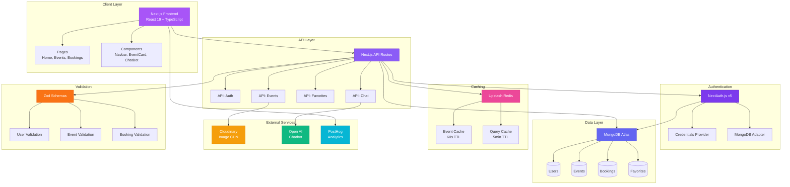
```mermaid
graph TB
    subgraph "Client Layer"
        A[Next.js Frontend<br/>React 19 + TypeScript]
        A1[Pages<br/>Home, Events, Bookings]
        A2[Components<br/>Navbar, EventCard, ChatBot]
        A --> A1
        A --> A2
    end

    subgraph "API Layer"
        B[Next.js API Routes]
        B1["API: Auth"]
        B2["API: Events"]
        B3["API: Favorites"]
        B4["API: Chat"]
        B --> B1
        B --> B2
        B --> B3
        B --> B4
    end

    subgraph "Authentication"
        C[NextAuth.js v5]
        C1[Credentials Provider]
        C2[MongoDB Adapter]
        C --> C1
        C --> C2
    end

    subgraph "Data Layer"
        D[MongoDB Atlas]
        D1[(Users)]
        D2[(Events)]
        D3[(Bookings)]
        D4[(Favorites)]
        D --> D1
        D --> D2
        D --> D3
        D --> D4
    end

    subgraph "Caching"
        E[Upstash Redis]
        E1[Event Cache<br/>60s TTL]
        E2[Query Cache<br/>5min TTL]
        E --> E1
        E --> E2
    end

    subgraph "External Services"
        F[Cloudinary<br/>Image CDN]
        G[Open AI<br/>Chatbot]
        H[PostHog<br/>Analytics]
    end

    subgraph "Validation"
        I[Zod Schemas]
        I1[User Validation]
        I2[Event Validation]
        I3[Booking Validation]
        I --> I1
        I --> I2
        I --> I3
    end

    A --> B
    B --> C
    B --> I
    C --> D
    B --> D
    B --> E
    B2 --> F
    B4 --> G
    A --> H

    style A fill:#a855f7,stroke:#7c3aed,color:#fff
    style B fill:#8b5cf6,stroke:#6d28d9,color:#fff
    style C fill:#7c3aed,stroke:#5b21b6,color:#fff
    style D fill:#6366f1,stroke:#4f46e5,color:#fff
    style E fill:#ec4899,stroke:#db2777,color:#fff
    style F fill:#f59e0b,stroke:#d97706,color:#fff
    style G fill:#10b981,stroke:#059669,color:#fff
    style H fill:#06b6d4,stroke:#0891b2,color:#fff
    style I fill:#f97316,stroke:#ea580c,color:#fff
```

## Screenshots

|                                                                                                         |                                                                                                                      |
| ------------------------------------------------------------------------------------------------------- | -------------------------------------------------------------------------------------------------------------------- |
| **Home Page (1)**<br/>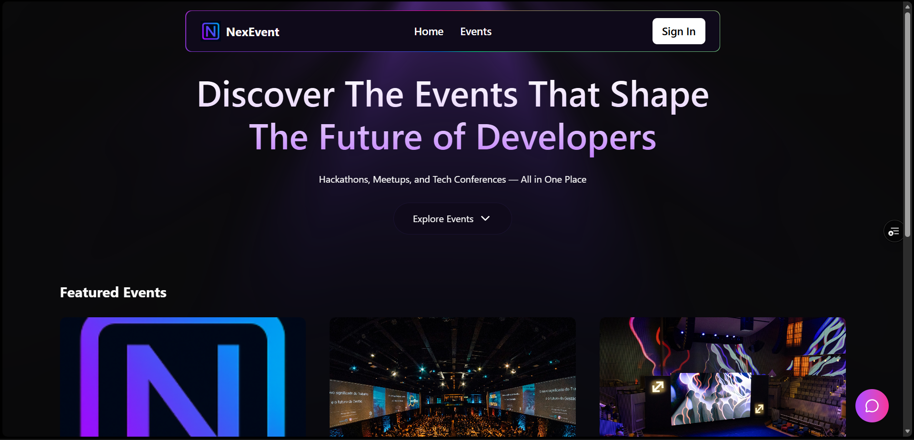                                | **Home Page (2)**<br/>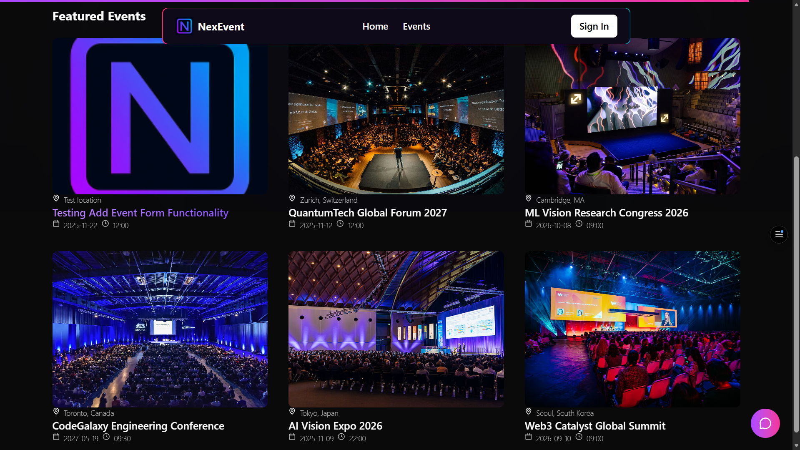                                             |
| **Login Page**<br/>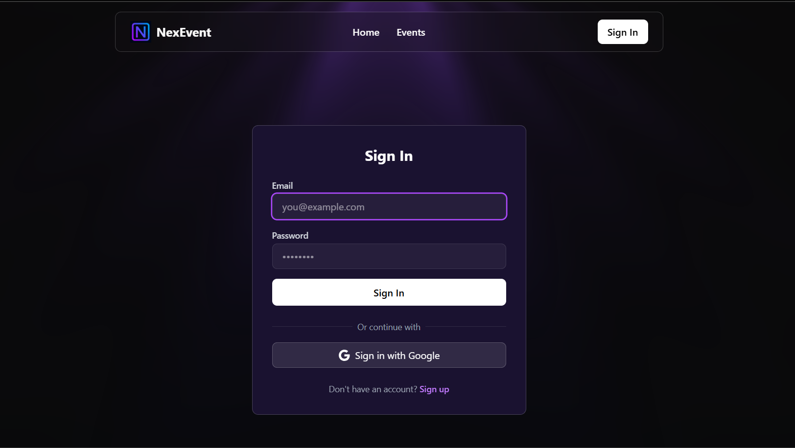                                          | **Signup Page**<br/>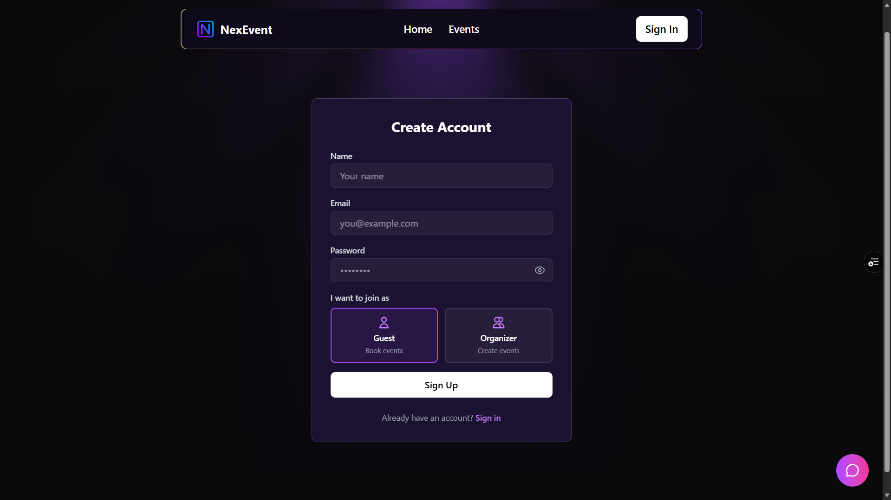                                               |
| **Events Page (1)**<br/>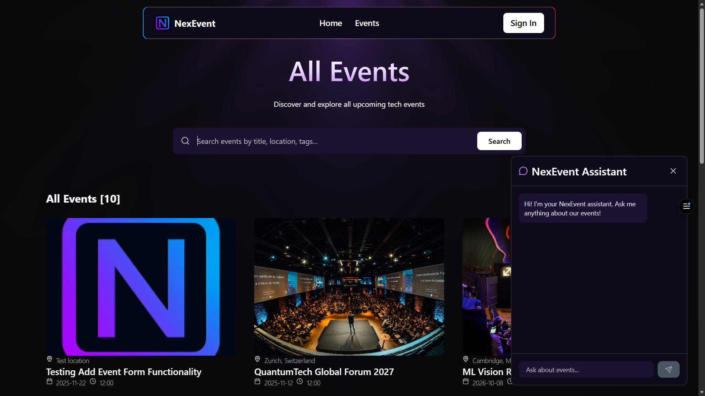                          | **Events Page (2)**<br/>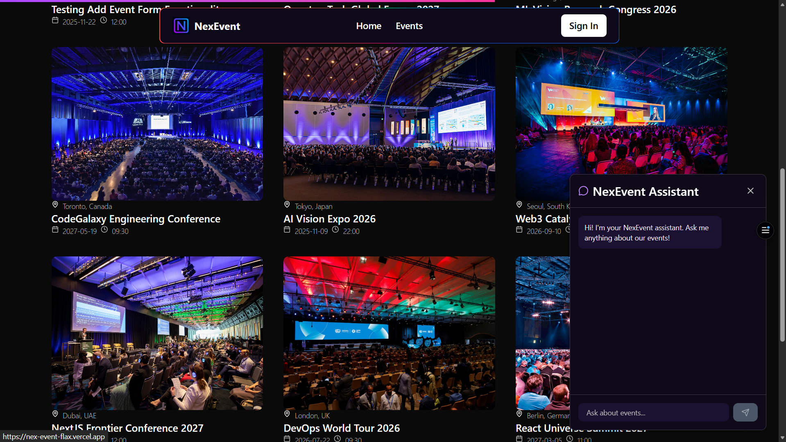                                       |
| **Guest Favourite Events**<br/>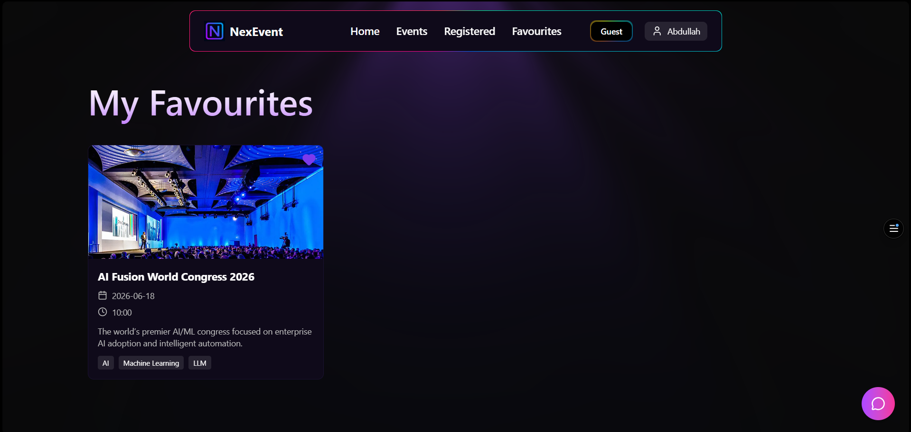 | **Guest Register Events**<br/>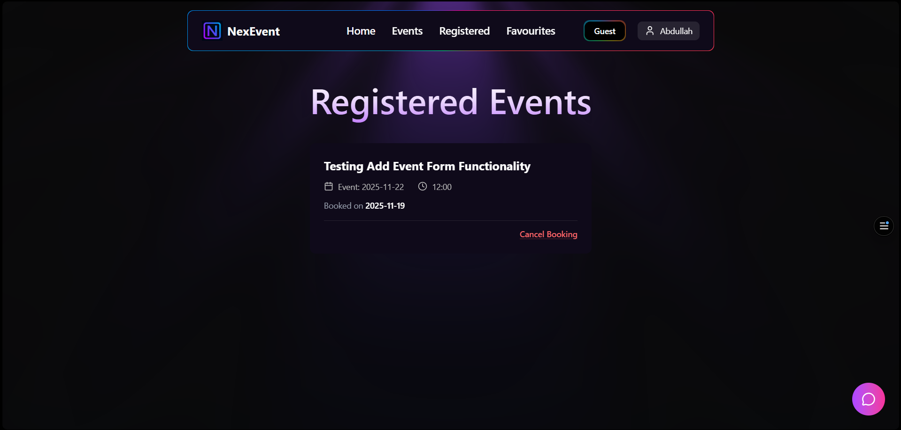                 |
| **Organizer Add Event**<br/>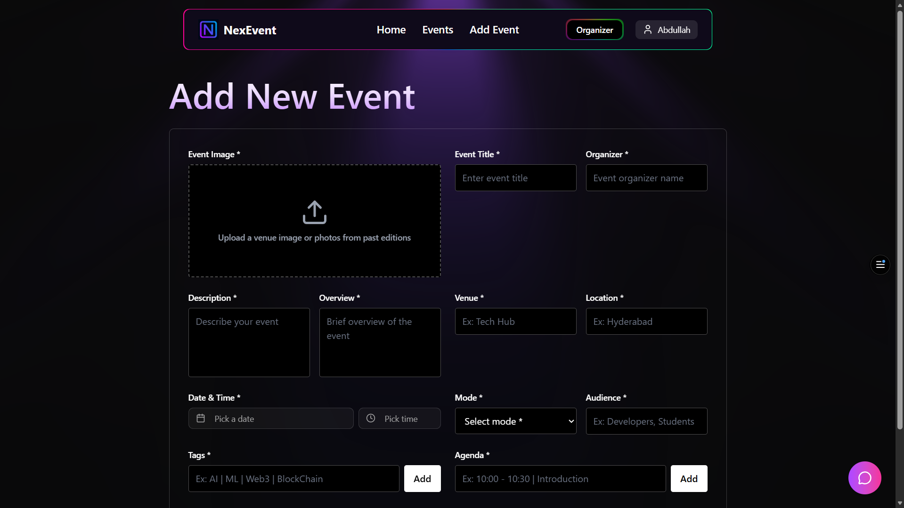      | **Organizer Event Management**<br/>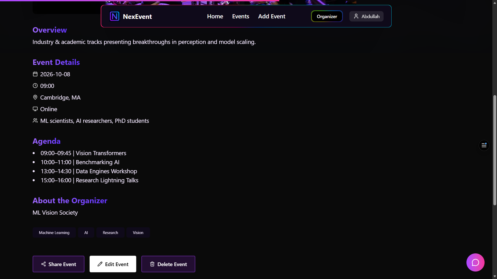 |

## Getting Started

### Quick Start

```bash
# Clone the repository
git clone https://github.com/YOUR_USERNAME/NexEvent.git
cd NexEvent

# Install dependencies
pnpm install

# Set up environment variables (see CONTRIBUTING.md)
cp .env.example .env

# Run development server
pnpm dev
```

Visit [http://localhost:3000](http://localhost:3000)

## Contributing

For detailed setup instructions, see [CONTRIBUTING.md](CONTRIBUTING.md)
